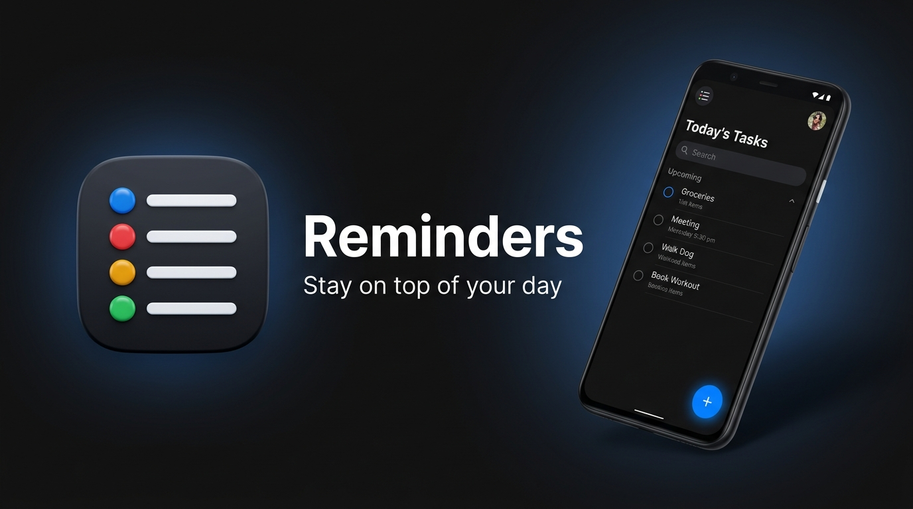

<div align="center">



# Reminders for Android

**Stay on top of your day.**  
A minimalist, distraction-free personal reminder application inspired by Apple Reminders and built natively for Android with **Kotlin** and **Jetpack Compose**.

[](#)
[](#)
[](#)
[](#)
[](#)
[-orange?style=flat-square)](#)

[Download Latest APK](./website/reminders.apk) • [Promotional Website](./website/index.html) • [Features](#-features) • [Architecture](#-architecture--tech-stack) • [Getting Started](#-getting-started)

</div>

---

## ✨ Overview

**Reminders** is crafted for clarity, speed, and reliability. Instead of bloated productivity dashboards, cloud sign-ups, or subscription walls, it focuses entirely on helping you capture and complete tasks with zero friction.

Every reminder is stored locally on your device using **Room SQLite** and scheduled through Android's native **AlarmManager** so alerts fire on time—even when your phone is idle or restarts.

---

## 🚀 Features

- **🛡️ 100% Offline & Private** — No cloud accounts, no internet permission, no analytics, and zero tracking. Your data never leaves your device.
- **⏰ Exact Time Alerts** — Uses `AlarmManager` (`setExactAndAllowWhileIdle`) with graceful Android 12+ (`SCHEDULE_EXACT_ALARM`) handling to deliver notifications right on schedule.
- **🔄 Smart Repeating Schedules** — Set tasks to repeat **Daily**, **Weekly**, or **Monthly**. When a repeating reminder triggers or is completed, the next occurrence is automatically calculated and scheduled.
- **🔔 Interactive Notifications** — Mark a reminder **Complete** or **Snooze (10m)** directly from the Android notification shade without opening the app.
- **⚡ Survives Device Reboots** — A dedicated `BootReceiver` listens for system startup (`BOOT_COMPLETED`, `LOCKED_BOOT_COMPLETED`, `MY_PACKAGE_REPLACED`) and automatically restores all active alarms.
- **🎨 Minimalist Light & Dark Themes** — Engineered with an iOS-inspired color palette (`#F8F8FA` paper white and `#101010` deep dark mode), crisp typography, and animated circular completion checkboxes.
- **🗂️ Intelligent Grouping** — Automatically organizes active tasks into **Overdue** (with red time accents), **Today**, and **Upcoming** sections, plus a dedicated **Completed** history tab.

---

## 📲 Download & Promotional Landing Page

This repository includes a ready-to-deploy promotional website and pre-built APK inside the [`/website`](./website) folder:

- **Direct APK File:** [`website/reminders.apk`](./website/reminders.apk)
- **Promotional Webpage:** [`website/index.html`](./website/index.html)
- **Vercel Config:** [`website/vercel.json`](./website/vercel.json) (configured with `application/vnd.android.package-archive` headers for one-tap mobile downloads)

### Hosting on Vercel
1. Import this repository into [Vercel](https://vercel.com).
2. Set the **Root Directory** to `website`.
3. Click **Deploy** — your promotional landing page and APK download button will be live immediately.

---

## 🏗️ Architecture & Tech Stack

The project follows **MVVM (Model-View-ViewModel)** and **Clean Architecture** principles with reactive Kotlin `StateFlow` streams:

| Layer | Technology | Purpose |
| :--- | :--- | :--- |
| **UI Layer** | Jetpack Compose + Material 3 | Declarative UI, custom circular checkboxes, bottom sheets, date/time pickers, edge-to-edge layout |
| **Navigation** | Navigation Compose | Smooth tab switching between **Reminders**, **Completed**, and **Settings** |
| **State Management** | `AndroidViewModel` + `StateFlow` | Reactive categorization into *Overdue*, *Today*, and *Upcoming* lists |
| **Local Persistence** | Room Database (`KSP`) | Offline SQLite storage with `Flow` queries and `RepeatType` converters |
| **Background & Alarms** | `AlarmManager` + `BroadcastReceiver` | Exact alarm scheduling, notification actions (`Complete`, `Snooze 10m`), and boot restoration |

---

## 📂 Project Structure

```text
├── app/src/main/
│   ├── java/com/example/
│   │   ├── data/
│   │   │   ├── local/
│   │   │   │   ├── ReminderDao.kt          # Reactive Flow & suspend SQLite queries
│   │   │   │   ├── ReminderDatabase.kt     # Room database singleton
│   │   │   │   ├── ReminderEntity.kt       # Table schema & TypeConverters
│   │   │   │   └── RepeatType.kt           # Recurrence enum (NONE, DAILY, WEEKLY, MONTHLY)
│   │   │   └── ReminderRepository.kt       # Data repository & initial sample seeding
│   │   ├── navigation/
│   │   │   └── AppNavigation.kt            # NavHost & minimalist bottom navigation bar
│   │   ├── notification/
│   │   │   ├── AlarmScheduler.kt           # Exact alarm scheduling & recurrence math
│   │   │   ├── BootReceiver.kt             # Reschedules active alarms after device reboot
│   │   │   ├── NotificationHelper.kt       # High-priority notification channel & actions
│   │   │   └── ReminderReceiver.kt         # Handles alarm triggers, Complete, and Snooze
│   │   ├── ui/
│   │   │   ├── components/                 # AddReminderSheet, ReminderItem, ReminderCheckbox, etc.
│   │   │   ├── screens/                    # HomeScreen, CompletedScreen, SettingsScreen
│   │   │   └── theme/                      # Color, Type, and Theme definitions
│   │   ├── viewmodel/
│   │   │   └── ReminderViewModel.kt        # UI state management & CRUD actions
│   │   ├── MainActivity.kt                 # Edge-to-edge host activity
│   │   └── ReminderApplication.kt          # App initialization & channel setup
│   └── AndroidManifest.xml                 # Permissions & receiver declarations
├── website/                                # Promotional landing page & APK distribution
│   ├── index.html
│   ├── reminders.apk
│   ├── icon.png
│   └── vercel.json
└── repo_cover.jpg                          # Repository cover image
```

---

## 🛠️ Getting Started

### Prerequisites
- **Android Studio** Ladybug (or newer)
- **JDK 17+**
- **Android SDK 36** (minimum supported device is **API 26 / Android 8.0**)

### Build & Run
1. **Clone the repository:**
   ```bash
   git clone https://github.com/your-username/reminders-android.git
   cd reminders-android
   ```
2. **Open in Android Studio** and let Gradle sync dependencies.
3. **Run on a device or emulator**, or build the debug APK via CLI:
   ```bash
   gradle assembleDebug
   ```
4. **Run unit & Robolectric tests:**
   ```bash
   gradle :app:testDebugUnitTest
   ```

---

## 🔐 Permissions Used

| Permission | Reason |
| :--- | :--- |
| `POST_NOTIFICATIONS` | Displays reminder alerts on Android 13+ (API 33+). Requested gracefully via an in-app banner. |
| `SCHEDULE_EXACT_ALARM` | Ensures reminders trigger at the exact minute selected by the user. |
| `RECEIVE_BOOT_COMPLETED` | Restores scheduled reminder alarms automatically when the device restarts. |

---

## 📄 License

This project is open source and available under the [MIT License](LICENSE).
